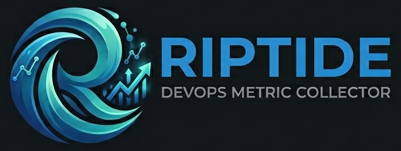

<p align="left">
  
</p>

Ingestion service for the **riptide** DevOps delivery-metrics suite.

## Table of contents

- [Overview](#overview)
- [What it collects](#what-it-collects)
- [Quickstart (local)](#quickstart-local)
- [Database](#database)
- [Documentation](#documentation)

## Overview

riptide is **built for the enterprise** — for organisations running self-hosted
toolchains behind a corporate firewall: Bitbucket Data Center, on-prem Jenkins,
OpenShift, and ArgoCD. It is **not** a SaaS, has no third-party data egress,
runs entirely inside your cluster, and is designed for the realities of
regulated environments (mandatory team / cost-centre attribution, auditable
config-as-code, no admin UIs that bypass change control).

## What it collects

Raw events from:

- **Bitbucket** (PR + push webhooks)
- **Jenkins** (build-pipeline notifications)
- **ArgoCD** (sync notifications)

…stored append-only in Postgres for later metric computation by other suite
components or ad-hoc SQL.

## Quickstart (local)

```bash
uv sync
podman-compose up   # boots Postgres + runs migrations + starts the app on :8000
```

Open http://localhost:8000/docs for Swagger UI.

## Database

**Postgres is provisioned externally — riptide-collector is not responsible for
the database lifecycle.** Connection URL (with credentials) is supplied at
runtime via the `RIPTIDE_DB_URL` env var, which on OpenShift is sourced from
the `riptide-collector-secrets` Secret created from
`openshift/shared/secret.env.example`.

The local `compose.yaml` runs a throwaway Postgres for development only —
production deployments connect to the cluster's existing Postgres.

## Documentation

See [`docs/`](docs/) for setup and onboarding guides:

- [Setup: Bitbucket webhook](docs/setup-bitbucket-webhook.md)
- [Setup: Jenkins notification](docs/setup-jenkins-notification.md)
- [Setup: ArgoCD notification](docs/setup-argocd-notification.md)
- [Onboarding a team](docs/onboarding-a-team.md)
- [OpenShift manifests](openshift/README.md)
